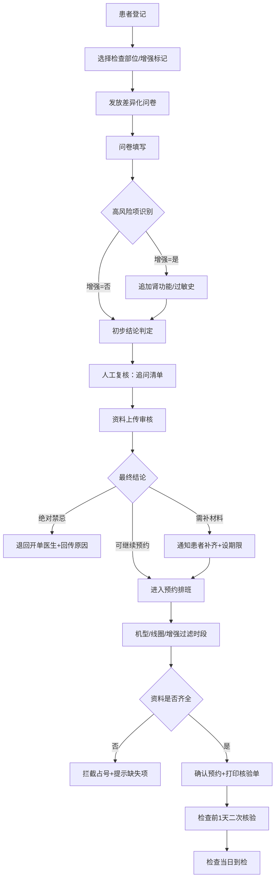

## 1. 产品概述

面向影像科预约中心与门诊护士的 MRI 检查前核验 Web 平台，将禁忌筛查、资料补齐和时段确认整合至统一工作台，旨在减少到检后退检率、降低机房空档、提升预约效率。
- 核心目标：拦截禁忌患者占号，提前补齐缺失材料，优化预约排班效率
- 目标用户：影像科预约中心工作人员、门诊护士、科室管理员

## 2. 核心功能

### 2.1 用户角色

| 角色 | 登录方式 | 核心权限 |
|------|----------|----------|
| 预约中心工作人员 | 工号登录 | 患者登记、问卷发放、预约排班、核验单打印 |
| 门诊护士 | 工号登录 | 问卷填写、人工复核、追问清单、资料上传 |
| 科室管理员 | 管理员账号 | 全部功能 + 数据统计、规则配置、结果回传 |

### 2.2 功能模块

1. **工作台首页**：待办任务统计、今日预约概览、高危预警看板、快捷入口
2. **患者登记模块**：患者信息录入、检查单信息导入、检查部位选择、增强扫描标记
3. **问卷筛查模块**：差异化问卷发放、高风险项自动识别、结论判定（三类）、增强扫描自动补查
4. **人工复核模块**：追问清单与标准话术、资料上传审核、人工结论调整、二次核验（检查前一天）
5. **预约排班模块**：机型/线圈/增强过滤可约时段、资料不全拦截、预约确认、时段调整
6. **结果回传模块**：退回原因回传开单医生、核验结论同步、沟通记录留痕
7. **数据统计模块**：退单原因统计、高频风险项分析、预约效率指标、规则优化建议

### 2.3 页面详情

| 页面名称 | 模块名称 | 功能描述 |
|----------|----------|----------|
| 工作台首页 | 待办看板 | 待筛查、待复核、待排班、待二次核验任务数量统计与快捷跳转 |
| 工作台首页 | 高危预警 | 实时展示识别出的绝对禁忌/高风险患者列表，红色高亮 |
| 工作台首页 | 今日预约 | 时段分布图、机房占用情况、到检状态统计 |
| 患者登记页 | 基础信息 | 姓名/性别/年龄/联系方式/病历号/开单科室/开单医生录入 |
| 患者登记页 | 检查信息 | 检查部位选择（下拉联动）、增强扫描开关、加急标记 |
| 问卷筛查页 | 问卷发放 | 根据检查部位自动加载对应筛查问卷模板 |
| 问卷筛查页 | 高风险识别 | 心脏起搏器/人工耳蜗/动脉瘤夹/金属异物/妊娠/幽闭恐惧自动标红弹窗 |
| 问卷筛查页 | 结论判定 | 自动区分"绝对禁忌/需补材料/可继续预约"三类并给出理由 |
| 问卷筛查页 | 增强补查 | 增强扫描时自动追加肾功能指标、碘过敏史问卷项 |
| 人工复核页 | 追问清单 | 按风险项生成护士追问条目清单，逐项勾选完成 |
| 人工复核页 | 标准话术 | 每条追问配套标准沟通话术，可一键复制 |
| 人工复核页 | 资料审核 | 植入物型号卡/手术记录上传预览、OCR辅助识别型号、审核通过/驳回 |
| 人工复核页 | 二次核验 | 检查前一天自动触发：近期手术、体内新植入物、空腹要求核验 |
| 预约排班页 | 时段过滤 | 按 MRI 机型、线圈类型、是否增强筛选可用时段 |
| 预约排班页 | 占号拦截 | 资料不全/结论为绝对禁忌患者无法点击预约按钮，弹出原因 |
| 预约排班页 | 预约确认 | 选择时段后生成预约号、发送短信通知、打印核验单 |
| 结果回传页 | 退回处理 | 选择退回原因模板、填写补充说明、一键回传至开单医生工作站 |
| 结果回传页 | 沟通记录 | 展示与开单医生的历史沟通记录时间线 |
| 核验单打印页 | 打印视图 | 患者信息、检查信息、筛查结论、注意事项、预约时段的可打印排版 |
| 数据统计页 | 退单分析 | 按周/月统计退单数量、退单原因分布图、趋势折线图 |
| 数据统计页 | 风险项统计 | 高频风险项排行榜、各风险项与退单关联度分析 |
| 数据统计页 | 效率指标 | 预约成功率、平均筛查耗时、机房空档率、到检后退检率 |

## 3. 核心流程

患者到预约中心登记 → 选择检查部位与是否增强 → 系统自动发放对应问卷 → 护士协助填写问卷 → 系统识别高风险项并自动判定初步结论 → 如为增强扫描追加肾功能与过敏史 → 人工复核（追问+资料审核）→ 判定最终结论：①绝对禁忌→退回开单医生并回传原因 ②需补材料→通知患者补齐并设置补料期限 ③可预约→进入排班 → 按机型/线圈/增强过滤时段 → 资料不全拦截占号 → 确认预约并打印核验单 → 检查前一天系统自动触发二次核验（近期手术/新植入物/空腹）→ 检查当日到检。

## 4. 用户界面设计

### 4.1 设计风格

务实高效的医疗工作台风格，强调信息密度与操作效率，减少视觉干扰。
- **主色调**：医疗蓝 `#1E6FD9` 作为品牌主色，搭配深蓝 `#0D3B7A` 作为强调色
- **功能色**：成功绿 `#22C55E`、警告橙 `#F59E0B`、危险红 `#EF4444`、信息青 `#06B6D4`
- **背景色**：浅灰 `#F1F5F9` 主背景、白色 `#FFFFFF` 卡片背景、极浅蓝 `#EFF6FF` 选中态
- **按钮风格**：直角微圆角（4px）、实心主按钮配白色文字、次要按钮配边框
- **字体**：中文用"思源黑体"，数字用"JetBrains Mono"，标题 16-20px 粗体、正文 14px 常规、辅助文字 12px
- **布局风格**：左侧固定导航栏 + 顶部面包屑状态栏 + 主内容区卡片式布局，高密度信息网格
- **图标风格**：线性简洁图标（Lucide Icons），高风险项配实心红色图标徽章

### 4.2 页面设计概览

| 页面名称 | 模块名称 | UI 元素 |
|----------|----------|---------|
| 工作台首页 | 待办看板 | 四色统计卡片（蓝绿橙红）带图标、数字加粗、点击跳转、悬停上浮 |
| 工作台首页 | 高危预警 | 红色边框警示卡片、患者姓名+风险项徽标、时间戳、处理按钮 |
| 问卷筛查页 | 问卷区 | 问答卡片列表、是/否切换开关、选择后展开子问题、高风险项标红边框+警示图标 |
| 问卷筛查页 | 结论面板 | 右侧固定结论卡片、三色结论标签（红/橙/绿）、风险项列表、处理建议 |
| 人工复核页 | 追问清单 | 待办列表样式、未完成项橙色圆点、完成项绿色对勾、话术气泡框一键复制 |
| 预约排班页 | 时段表格 | 按日期×机房矩阵网格、可用/已占用/已满三种状态色块、悬停显示时段详情 |
| 预约排班页 | 拦截弹窗 | 红色模态框、缺失材料清单、补料建议、关闭按钮（不可跳过） |
| 核验单打印页 | 打印视图 | A4 排版、顶部医院抬头、表格化信息、底部护士签字栏、打印专用样式 |
| 数据统计页 | 图表区 | 柱状图（退单原因）、折线图（趋势）、饼图（风险占比）、数据表格可导出 |

### 4.3 响应性

桌面端优先设计（1920×1080 基准），关键页面适配 1440px 和 1366px 屏幕；移动端仅支持首页待办查看与预警消息推送，核心操作限定桌面端完成以保证核验严谨性。
