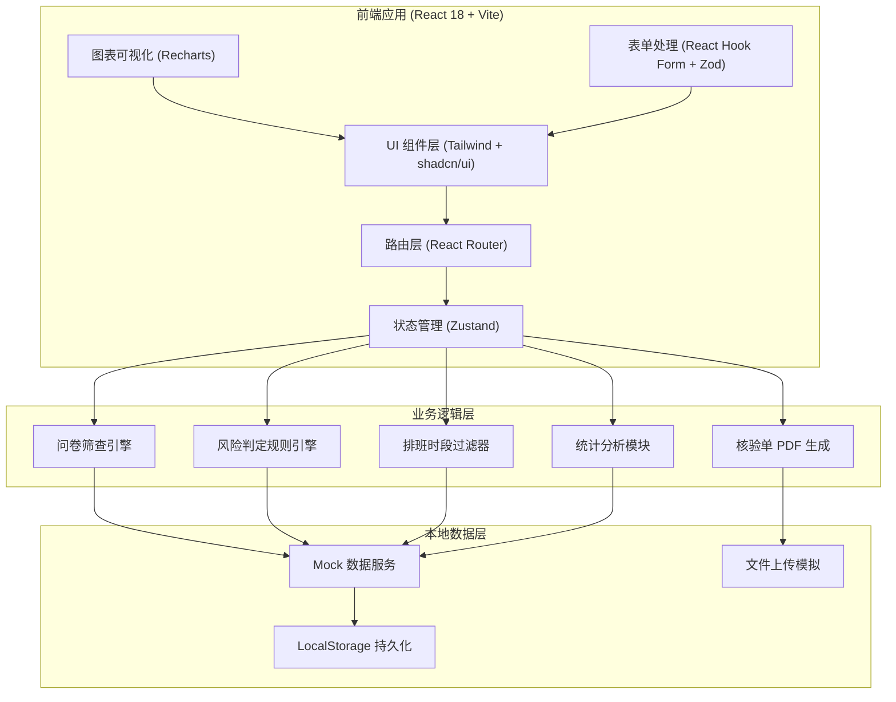
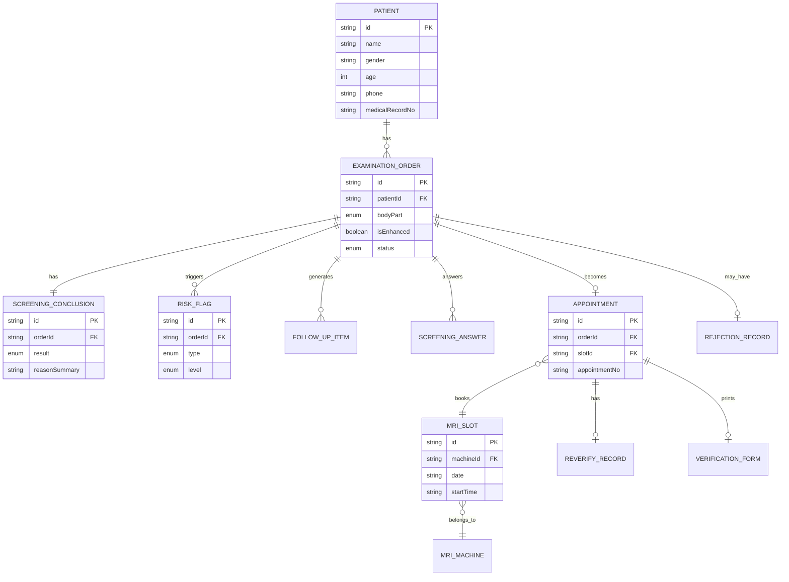

## 1. 架构设计



## 2. 技术选型

- **前端框架**: React@18 + TypeScript@5
- **构建工具**: Vite@5（初始化使用 vite-init）
- **样式方案**: TailwindCSS@3 + PostCSS + Autoprefixer
- **UI 组件库**: shadcn/ui（基于 Radix UI 原语）
- **图标库**: lucide-react
- **状态管理**: Zustand@4（轻量型，替代 Redux）
- **路由**: React Router DOM@6
- **表单**: React Hook Form@7 + Zod@3 校验
- **图表**: Recharts@2
- **日期处理**: date-fns@3
- **后端**: 无后端，使用 Mock 数据 + LocalStorage 模拟持久化
- **数据库**: 无数据库，JSON 文件作为 Mock 数据源

## 3. 路由定义

| 路由路径 | 页面名称 | 用途说明 |
|----------|----------|----------|
| `/login` | 登录页 | 工号/密码登录，角色选择 |
| `/dashboard` | 工作台首页 | 待办看板、高危预警、今日预约概览 |
| `/patients` | 患者列表 | 所有患者记录，搜索筛选，快捷操作 |
| `/patients/register` | 患者登记 | 新建患者+检查单信息录入 |
| `/patients/:id/screening` | 问卷筛查 | 差异化问卷填写、风险识别、初步结论 |
| `/patients/:id/review` | 人工复核 | 追问清单、标准话术、资料审核、结论调整 |
| `/patients/:id/scheduling` | 预约排班 | 时段过滤、占号拦截、预约确认 |
| `/patients/:id/callback` | 结果回传 | 退回原因、回传开单医生、沟通记录 |
| `/patients/:id/print` | 核验单打印 | 可打印的检查前核验单视图 |
| `/patients/:id/reverify` | 二次核验 | 检查前一天的再次核验流程 |
| `/statistics` | 数据统计 | 退单分析、风险项统计、效率指标 |
| `/statistics/reasons` | 退单原因明细 | 退单原因列表与详情 |
| `/statistics/risks` | 风险项排行 | 高频风险项分析视图 |

## 4. Mock 数据类型定义

```typescript
// 患者信息
interface Patient {
  id: string;
  name: string;
  gender: 'male' | 'female';
  age: number;
  phone: string;
  medicalRecordNo: string;
  idCardNo: string;
  orderingDepartment: string;
  orderingDoctor: string;
  createdAt: string;
}

// 检查单
interface ExaminationOrder {
  id: string;
  patientId: string;
  bodyPart: BodyPart;
  isEnhanced: boolean;
  isUrgent: boolean;
  mriMachineRequired?: string;
  coilRequired?: string;
  clinicalDiagnosis: string;
  status: 'pending_screening' | 'screening_done' | 'review_pending' | 'review_done' | 'scheduling_pending' | 'scheduled' | 'reverify_pending' | 'completed' | 'rejected';
  createdAt: string;
}

// 检查部位枚举
type BodyPart = 'brain' | 'spine_cervical' | 'spine_lumbar' | 'chest' | 'abdomen' | 'pelvis' | 'knee' | 'shoulder' | 'cardiac' | 'mammary' | 'neck';

// 筛查问卷答案
interface ScreeningAnswer {
  orderId: string;
  questionId: string;
  answer: boolean | string;
  subAnswers?: Record<string, boolean | string>;
  answeredAt: string;
}

// 高风险项
interface RiskFlag {
  id: string;
  orderId: string;
  type: 'pacemaker' | 'cochlear_implant' | 'aneurysm_clip' | 'metal_foreign_body' | 'pregnancy' | 'claustrophobia' | 'renal_insufficiency' | 'iodine_allergy' | 'recent_surgery' | 'other';
  level: 'absolute_contraindication' | 'needs_materials' | 'follow_up';
  description: string;
  confirmed: boolean;
  createdAt: string;
}

// 筛查结论
interface ScreeningConclusion {
  orderId: string;
  result: 'absolute_contraindication' | 'materials_needed' | 'proceed';
  reasonSummary: string;
  riskFlags: string[];
  materialsRequired?: MaterialRequirement[];
  preliminaryAt: string;
  reviewedAt?: string;
  reviewedBy?: string;
  finalResult?: 'absolute_contraindication' | 'materials_needed' | 'proceed' | 'rejected';
}

// 需补材料
interface MaterialRequirement {
  type: 'implant_card' | 'surgical_record' | 'renal_report' | 'allergy_record' | 'pregnancy_test' | 'other';
  label: string;
  uploaded: boolean;
  fileName?: string;
  uploadedAt?: string;
  notes?: string;
}

// 追问条目
interface FollowUpItem {
  id: string;
  orderId: string;
  question: string;
  standardScript: string;
  riskType: string;
  completed: boolean;
  answer?: string;
  completedAt?: string;
  completedBy?: string;
}

// MRI 机型与时段
interface MRISlot {
  id: string;
  date: string;
  startTime: string;
  endTime: string;
  machineId: string;
  machineName: string;
  coilType: string;
  supportsEnhanced: boolean;
  isAvailable: boolean;
  bookedBy?: string;
  bookedOrderId?: string;
}

// MRI 机型
interface MRIMachine {
  id: string;
  name: string;
  model: string;
  roomNo: string;
  supportedCoils: string[];
  supportsEnhanced: boolean;
}

// 预约记录
interface Appointment {
  id: string;
  orderId: string;
  slotId: string;
  patientId: string;
  appointmentNo: string;
  confirmedAt: string;
  confirmedBy: string;
  status: 'confirmed' | 'cancelled' | 'completed' | 'no_show';
  reverifyStatus?: 'pending' | 'passed' | 'failed';
  reverifyAt?: string;
}

// 退回记录
interface RejectionRecord {
  id: string;
  orderId: string;
  reasonCode: string;
  reasonText: string;
  additionalNote: string;
  rejectedBy: string;
  rejectedAt: string;
  callbackStatus: 'pending' | 'sent' | 'replied';
  doctorReply?: string;
  repliedAt?: string;
}

// 二次核验记录
interface ReverifyRecord {
  id: string;
  appointmentId: string;
  orderId: string;
  recentSurgery: boolean;
  recentSurgeryDetail?: string;
  newImplants: boolean;
  newImplantsDetail?: string;
  fastingConfirmed: boolean;
  fastingDetail?: string;
  passed: boolean;
  verifiedBy: string;
  verifiedAt: string;
}

// 核验单
interface VerificationForm {
  id: string;
  appointmentId: string;
  patientInfo: Patient;
  examInfo: ExaminationOrder;
  conclusion: ScreeningConclusion;
  appointmentInfo: Appointment;
  risksSummary: string[];
  precautions: string[];
  generatedAt: string;
  generatedBy: string;
}

// 统计数据
interface StatisticsData {
  periodStart: string;
  periodEnd: string;
  totalOrders: number;
  scheduledCount: number;
  rejectionCount: number;
  rejectionReasons: Array<{ code: string; count: number; label: string }>;
  topRiskFlags: Array<{ type: string; count: number; label: string }>;
  avgScreeningDurationMinutes: number;
  roomUtilizationRate: number;
  noShowRate: number;
  onSiteRejectionRate: number;
}

// 用户
interface User {
  id: string;
  employeeId: string;
  name: string;
  role: 'booking_staff' | 'nurse' | 'admin';
  department: string;
}
```

## 5. 数据模型关系图



## 6. 核心引擎与规则

### 6.1 问卷筛查引擎
- 根据 `BodyPart` 动态加载对应问卷题目配置
- 当 `isEnhanced=true` 时，自动注入肾功能（eGFR、肌酐）与碘过敏史题目
- 答案与风险规则映射：每个 `questionId` 配置触发风险的条件

### 6.2 风险判定规则引擎
```typescript
// 规则优先级
const RULE_PRIORITY = {
  pacemaker: 'absolute',      // 心脏起搏器 → 绝对禁忌
  cochlear_implant: 'absolute', // 人工耳蜗 → 绝对禁忌
  aneurysm_clip: 'conditional', // 动脉瘤夹 → 需型号卡确认
  metal_foreign_body: 'conditional', // 金属异物 → 需部位+材质确认
  pregnancy: 'conditional',   // 妊娠 → 需孕周+临床评估
  claustrophobia: 'follow_up', // 幽闭恐惧 → 可考虑镇静
  renal_insufficiency: 'enhanced_only', // 仅增强扫描需评估
  iodine_allergy: 'enhanced_only',
};
```

### 6.3 排班过滤器
- 输入：`{ machineId?, coilType?, isEnhanced?, dateRange }`
- 过滤链：机型匹配 → 线圈兼容 → 增强支持 → 时段可用性 → 排除该患者禁忌机型
- 输出：按日期分组的可预约时段列表

## 7. 目录结构

```
src/
├── assets/              # 静态资源（打印模板 CSS 等）
├── components/          # 通用组件
│   ├── ui/             # shadcn/ui 原语组件
│   ├── layout/         # Sidebar、Topbar、Breadcrumb
│   ├── patient/        # 患者信息卡、搜索栏
│   ├── screening/      # 问卷卡片、风险徽章、结论面板
│   ├── review/         # 追问条目、话术气泡、资料上传
│   ├── scheduling/     # 时段表格、过滤栏、拦截弹窗
│   ├── statistics/     # 图表容器、统计卡片、导出按钮
│   └── print/          # 核验单打印组件
├── pages/              # 路由页面（对应 3. 路由表）
├── stores/             # Zustand stores
│   ├── authStore.ts
│   ├── patientStore.ts
│   ├── screeningStore.ts
│   ├── reviewStore.ts
│   ├── schedulingStore.ts
│   └── statisticsStore.ts
├── data/               # Mock 数据 + 问卷配置
│   ├── mock/           # 模拟数据 JSON
│   ├── questionnaires/ # 各部位问卷配置
│   ├── riskRules.ts    # 风险规则
│   └── scripts.ts      # 标准话术配置
├── engines/            # 业务引擎
│   ├── screeningEngine.ts
│   ├── riskEngine.ts
│   ├── schedulingFilter.ts
│   └── statisticsCalculator.ts
├── hooks/              # 自定义 React Hooks
├── utils/              # 工具函数（date、format、storage）
├── types/              # TypeScript 类型定义
├── router.tsx          # 路由配置
├── App.tsx
└── main.tsx
```
